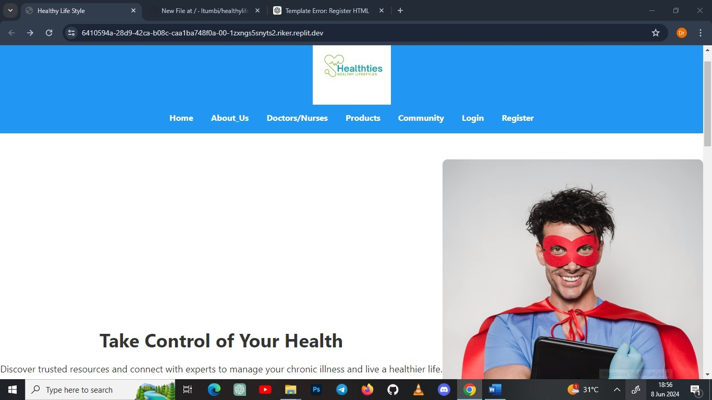

# Healthy Lifestyle

Welcome to the **Healthy Lifestyle** project! This platform provides comprehensive resources and support for managing chronic illnesses, promoting well-being, and maintaining a healthy lifestyle. It offers educational guides, expert advice, and a community to help users and caregivers thrive in their health journeys.

---

## Table of Contents

- [Project Overview](#project-overview)
- [Features](#features)
- [Installation](#installation)
- [Usage](#usage)
- [Contributing](#contributing)
- [License](#license)
- [Contact](#contact)
- [Screenshots](#screenshots)

---

## Project Overview

**Healthy Lifestyle** is designed to support individuals with chronic diseases and their caregivers by providing:

- Educational guides on managing chronic conditions.
- Nutrition and exercise recommendations.
- Stress management tips.
- A supportive community.
- Access to healthcare professionals.

---

## Features

- **Educational Guides**: Detailed guides on chronic illness management, nutrition, exercise, and stress management.
- **Expert Advice**: Connect with healthcare professionals for personalized advice.
- **Community Support**: Join a community of individuals sharing similar experiences.
- **Product Recommendations**: Explore products tailored to manage various health conditions.
- **Responsive Design**: Accessible on various devices for ease of use.

---

## Installation

Follow these steps to set up the project on your local machine.

### Prerequisites

- Python 3.x
- Django 4.x
- Virtual Environment

### Steps

1. **Clone the Repository**:
   ```bash
   git clone https://github.com/itumbi/healthy_lifestyle.git
   cd healthy_lifestyle

2. **Create and Activate a Virtual Environment**:
   ```bash
   python -m venv venv
   source venv/bin/activate # On Windows: venv\Scripts\activate

3. **Install Dependencies**:
   ```bash
   pip install -r requirements.txt

4. **Apply Migrations**:
   ```bash
   python manage.py migrate

5. **Run the Development Server**:
   ```bash
   python manage.py runserver

6. **Access the Application**:

  Open your browser and navigate to http://127.0.0.1:8000/.

---

## Usage
The platform includes various guides and resources:

-**Explore Guides**: Navigate to /guides to access various educational guides.
-**Nutrition Guide**: Visit /guides/nutrition_guide for information on maintaining a healthy diet.
-**Exercise Guide**: Visit /guides/exercise_guide for recommendations on exercise tailored to different conditions.
-**Stress Management Guide**: Visit /guides/stress_management_guide for tips on managing stress effectively.
-**Join Community**: Register at /register to join the community and connect with others.

---

## Contributing
 We welcome contributions to enhance the platform. To contribute:

---
## Fork the repository.
Create a new branch (git checkout -b feature-branch).
Make your changes and commit (git commit -m 'Add new feature').
Push to the branch (git push origin feature-branch).
Create a Pull Request.

## License
This project is licensed under the MIT License - see the LICENSE file for details.

## Contact
For any inquiries or support, please contact:

-**Project Maintainer**: Itumbi manase itumbi
-**Email**: imanase37@gmail.com
-**GitHub**:(https://github.com/itumbi)


## Screenshots



